# AnyMod — Software Requirements Specification & Architecture Documen

**AI-Powered VS Code Coding Assistant with Bring Your Own API Key (BYOK)**

| | |
|---|---|
| **Document Version** | 1.0 |
| **Status** | Draft for Engineering Review |
| **Audience** | Senior Software Engineers, Architects, QA |

---

## 1. Project Overview

### 1.1 Vision
AnyMod is a VS Code extension that provides agentic, context-aware coding assistance (chat, inline edits, autonomous multi-step tasks) while letting users connect their own AI provider credentials (BYOK) instead of routing traffic through a vendor-owned backend. The core engine is designed to be portable into a future standalone desktop IDE with minimal rework.

### 1.2 Goals
- Deliver Cursor/Cline-class agentic coding assistance inside VS Code.
- Support 8 AI providers (OpenAI, Anthropic, Gemini, OpenRouter, Groq, DeepSeek, Ollama, Azure OpenAI) via a single abstraction.
- Keep all user code and secrets local; no proxy backend required for core functionality.
- Ship a modular monolith whose `packages/core` is UI- and host-agnostic, enabling reuse in a future Electron/Tauri desktop IDE.
- Provide safe, approval-gated tool execution (file writes, terminal, git).

### 1.3 Scope
**In scope:** VS Code extension, agent engine, context engine, tool system, provider abstraction, local persistence, MCP client support, Git/terminal integration.
**Out of scope (v1):** Multi-user collaboration, cloud sync, team billing, mobile clients, custom model fine-tuning.

### 1.4 Target Users
- Professional developers who prefer paying providers directly (cost control, data governance).
- Teams with enterprise Azure OpenAI or self-hosted Ollama deployments.
- Open-source contributors who want a vendor-neutral AI coding tool.

### 1.5 Design Principles
| Principle | Implication |
|---|---|
| Host-agnostic core | `packages/core` never imports `vscode` directly; all host I/O goes through injected ports. |
| Explicit over implicit | Every file write, terminal command, and destructive action requires an approval step (configurable). |
| Provider neutrality | No hardcoded prompts/behavior tied to one vendor's API shape. |
| Local-first | SQLite for all persistence; no telemetry by default. |
| Composability | Strategy/Command/Repository/Plugin patterns over inheritance-heavy designs. |

---

## 2. Software Requirements Specification

### 2.1 Functional Requirements

| ID | Requirement |
|---|---|
| FR-1 | User can configure one or more AI providers with API keys, base URLs, and default models. |
| FR-2 | User can chat with the assistant in a dedicated webview panel, with streaming responses. |
| FR-3 | Assistant can propose multi-file edits, shown as Monaco diffs before applying. |
| FR-4 | Assistant can execute an autonomous agent loop (plan → act → observe → repeat) bounded by a step/token budget. |
| FR-5 | Assistant can read files, write files, search the workspace, run terminal commands, and query Git state via a tool system. |
| FR-6 | User can approve, reject, or auto-approve individual tool invocations, configurable per tool type. |
| FR-7 | Assistant gathers context automatically from active editor, open tabs, imports, diagnostics, and Git diff. |
| FR-8 | User can pin/attach specific files, symbols, or terminal output to the context window. |
| FR-9 | System supports semantic (embedding-based) search across the workspace for relevant code retrieval. |
| FR-10 | User can switch AI provider/model mid-conversation without losing context. |
| FR-11 | System persists conversation history, task checkpoints, and tool logs locally (SQLite). |
| FR-12 | System supports Model Context Protocol (MCP) servers as pluggable external tool providers. |
| FR-13 | System estimates token usage and cost per request before sending, using provider pricing tables. |
| FR-14 | System retries failed provider calls with exponential backoff and provider failover (optional). |
| FR-15 | User can roll back any agent-applied change via checkpoint/snapshot restore. |

### 2.2 Non-Functional Requirements

| ID | Category | Requirement |
|---|---|---|
| NFR-1 | Performance | Chat first-token latency < 1.5s (network-bound, excluded from budget). |
| NFR-2 | Performance | Context assembly for a 50k-LOC workspace completes in < 800ms (cached). |
| NFR-3 | Security | API keys stored only in OS-native secret stores; never written to disk in plaintext. |
| NFR-4 | Security | All file/terminal tool calls pass through a policy gate before execution. |
| NFR-5 | Reliability | Extension must not crash the VS Code host process on provider/tool failure. |
| NFR-6 | Portability | `packages/core` has zero direct dependency on `vscode` module. |
| NFR-7 | Observability | All agent steps and tool calls are logged (Pino) with correlation IDs. |
| NFR-8 | Extensibility | New providers addable by implementing a single `ProviderAdapter` interface. |
| NFR-9 | Testability | Core packages maintain ≥ 80% unit test coverage (Vitest). |
| NFR-10 | Compatibility | Supports VS Code ^1.85, Node 18+, macOS/Windows/Linux. |

### 2.3 Representative User Stories

| As a... | I want to... | So that... |
|---|---|---|
| Developer | connect my own OpenAI key | I control cost and data flow |
| Developer | see a diff before code is changed | I retain full review control |
| Developer | let the agent run a multi-step refactor | I save time on repetitive tasks |
| Team lead | point the extension at our Azure OpenAI endpoint | we meet compliance requirements |
| Power user | attach an MCP server (e.g., database tool) | the agent can query our internal systems |
| Developer | roll back an agent's changes | I can safely experiment |

### 2.4 Assumptions
- Users have valid API credentials for at least one supported provider.
- VS Code Secret Storage API is available on all target platforms.
- Workspace size is bounded by typical monorepo scale (≤ ~200k files with indexing).

### 2.5 Constraints
- Must run within VS Code extension host memory/CPU limits (single-threaded extension host; heavy work offloaded to worker threads).
- No mandatory backend service; any optional telemetry backend is opt-in.
- MCP servers run as external processes; the extension only manages their lifecycle over stdio/SSE.

### 2.6 Acceptance Criteria (Sample — FR-4 Agent Loop)
- Given a user task prompt, the agent produces a plan, executes tools with approval gating, and stops when the task is marked complete, a step limit is hit, or the user cancels.
- Every tool call and its result is persisted and visible in an execution timeline.
- Cancelling mid-run leaves the workspace in a state fully described by applied checkpoints (no partial, unlogged writes).

---

## 3. Technology Stack

| Technology | Purpose | Why Selected |
|---|---|---|
| TypeScript | Primary language | Type safety across extension, core, and UI boundaries |
| VS Code Extension API | Host integration | Native commands, webviews, editor/diagnostics access |
| React | Webview UI | Component reuse across future desktop shell |
| Tailwind CSS | Styling | Fast iteration, consistent design tokens |
| Radix UI | Accessible primitives | Unstyled, accessible components under Tailwind |
| Vite | Webview bundling | Fast HMR for UI development |
| esbuild | Extension bundling | Fast, minimal-config bundling for Node target |
| pnpm | Package manager | Efficient monorepo dependency management |
| Turborepo | Build orchestration | Incremental, cached builds across packages |
| SQLite | Local persistence | Zero-ops embedded storage for history/state |
| Drizzle ORM | Data access | Type-safe schema and queries over SQLite |
| Zod | Validation | Runtime schema validation for tool I/O and configs |
| Pino | Logging | Low-overhead structured logging |
| simple-git | Git integration | Programmatic git operations without shell parsing |
| Tree-sitter | Code parsing | Fast, incremental, language-agnostic AST parsing |
| react-markdown | Chat rendering | Safe markdown/code-block rendering in webview |
| Monaco Diff Editor | Diff review | Native VS Code-grade diff UX in webview |
| Vitest | Unit testing | Fast, ESM-native, Jest-compatible API |
| Playwright | E2E testing | Extension host + webview integration testing |
| Provider SDKs (OpenAI, Anthropic, Gemini, OpenRouter, Ollama) | Model access | Official/community SDKs behind a common adapter |

---

## 4. High-Level Architecture

| Layer | Responsibility |
|---|---|
| VS Code Extension Layer | Activation, commands, editor/diagnostics APIs, webview hosting, secret storage |
| React Webview | Chat UI, diff review, settings, task timeline |
| Agent Core | Planning, orchestration loop, prompt construction, response handling |
| Context Engine | Gathers/ranks/compresses context from workspace signals |
| Tool Engine | Executes registered tools under policy gating |
| Provider Layer | Normalizes provider APIs behind one interface; streaming, retries, cost estimation |
| Memory Layer | Conversation/task history, embeddings index, checkpoints (SQLite) |
| Git Integration | Diff extraction, commit/branch awareness, staged-change context |
| Terminal Integration | Command execution, output capture, approval gating |
| MCP Layer | Discovers/connects external MCP servers as additional tools |
| Local Storage | SQLite database, OS secret store, workspace-scoped cache |

The **Extension Layer** and **Webview** are VS Code–specific (the "host shell"). Everything else lives in `packages/core` and is host-agnostic, communicating only through defined ports (`HostPort`, `FsPort`, `TerminalPort`, `SecretPort`), which is what enables desktop-IDE reuse (Section 12, Phase 5).

---

## 5. Architecture Diagrams

### 5.1 Overall System Architecture
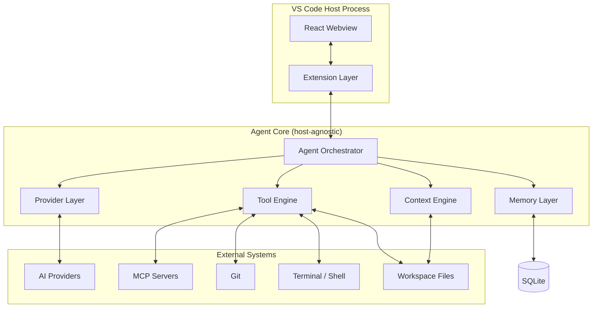
The extension host mediates between the webview and the host-agnostic core; the core never touches VS Code APIs directly, only external systems via tools/providers.

### 5.2 Layered Architecture
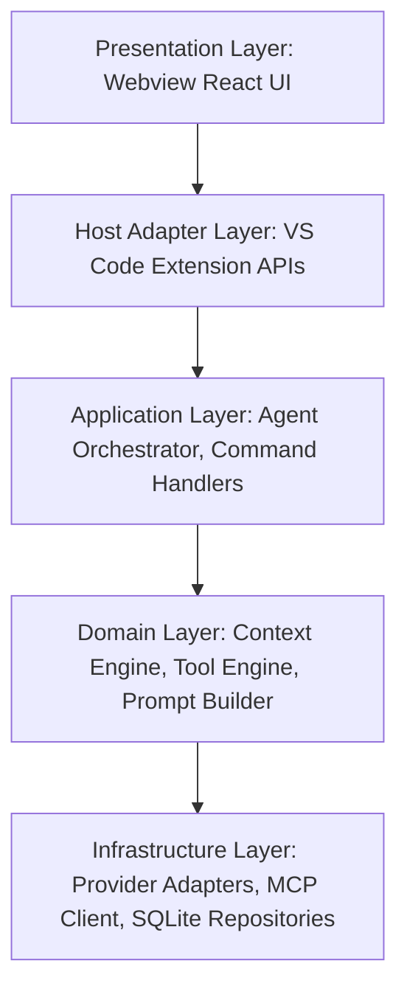
Strict downward dependency flow; the domain layer defines interfaces that infrastructure implements (Dependency Inversion), enabling provider/tool substitution without touching orchestration logic.

### 5.3 Component Diagram
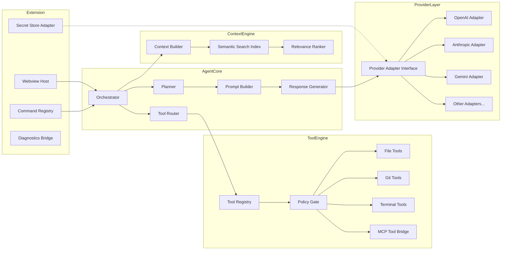

### 5.4 Agent Execution Flow
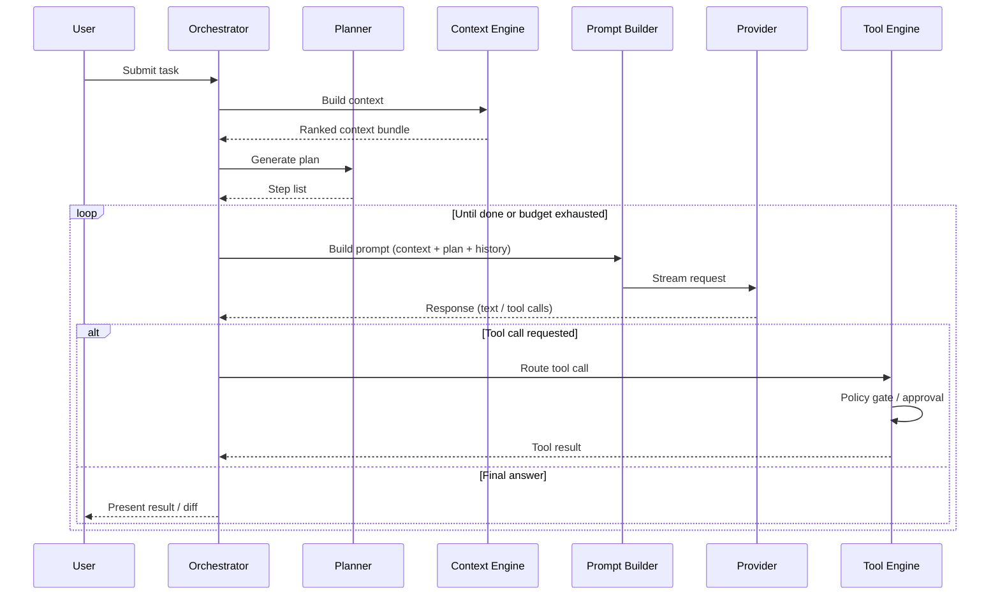

### 5.5 Context Building Flow
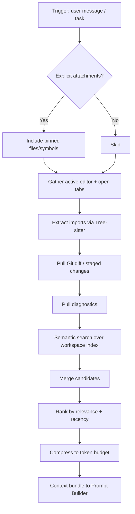

### 5.6 Tool Execution Flow
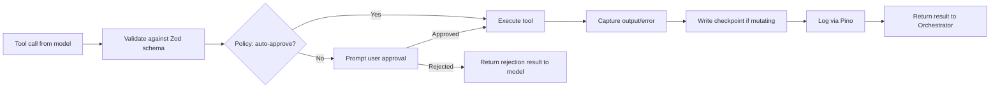

### 5.7 AI Provider Architecture
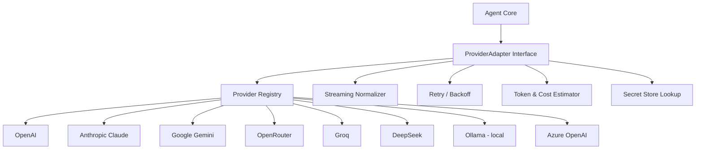
All adapters implement `send()`, `stream()`, `countTokens()`, and `listModels()`; the interface normalizes tool-calling formats (OpenAI functions, Anthropic tool_use, Gemini function calling) into one internal representation.

### 5.8 VS Code ↔ Webview Communication
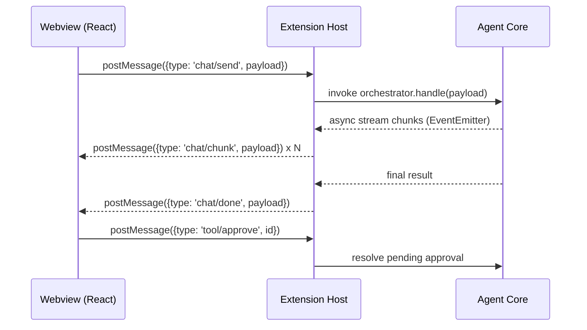
All messages are Zod-validated on both sides; the webview holds no direct access to Node APIs (CSP-restricted, `acquireVsCodeApi()` only).

### 5.9 Project Folder Structure (Diagram)
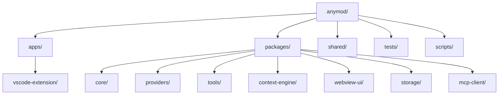

### 5.10 Deployment Diagram
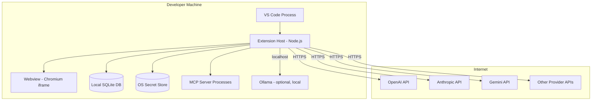
No mandatory server component; all state and secrets remain on the developer's machine.

---

## 6. Recommended Folder Structure

```
anymod/
├── apps/
│   └── vscode-extension/       # Extension entry point, activation, VS Code API glue
├── packages/
│   ├── core/                   # Orchestrator, Planner, host-agnostic domain logic
│   ├── context-engine/         # Context builder, ranking, semantic index
│   ├── tools/                  # Tool registry + implementations (fs, git, terminal)
│   ├── providers/              # Provider adapters (openai, anthropic, gemini, ...)
│   ├── mcp-client/             # MCP server discovery, lifecycle, tool bridging
│   ├── storage/                # Drizzle schema, repositories, SQLite migrations
│   └── webview-ui/             # React + Tailwind + Radix chat/diff/settings UI
├── shared/
│   ├── types/                  # Shared Zod schemas & TS types (messages, tools, config)
│   └── config/                 # Shared eslint/tsconfig/tailwind base configs
├── tests/
│   ├── unit/                   # Vitest unit tests per package
│   └── e2e/                    # Playwright extension-host + webview tests
└── scripts/
    ├── build.ts                 # Turborepo-driven build orchestration
    └── release.ts                # Packaging (vsce) and versioning
```

| Folder | Responsibility |
|---|---|
| `apps/vscode-extension` | Thin host shell: activation, commands, webview hosting, secret storage bridge |
| `packages/core` | Orchestrator, Planner, Prompt Builder, Response Generator — no `vscode` imports |
| `packages/context-engine` | File/diagnostics/git signal collection, embeddings, ranking |
| `packages/tools` | Tool interfaces + implementations, policy gate |
| `packages/providers` | One adapter per AI provider behind a common interface |
| `packages/mcp-client` | MCP protocol client, server process management |
| `packages/storage` | Drizzle schema + repositories for conversations, checkpoints, embeddings cache |
| `packages/webview-ui` | React UI, compiled via Vite, injected into the VS Code webview |
| `shared/types` | Zod schemas shared across extension/core/webview message boundaries |

---

## 7. Agent Architecture

| Component | Responsibility |
|---|---|
| Planner | Decomposes a user task into an ordered step list; re-plans on tool failure or new information |
| Context Builder | Assembles the ranked, budget-compressed context bundle (delegates to Context Engine) |
| Prompt Builder | Merges system instructions, context, plan, and history into the provider-specific request format |
| Tool Router | Maps model-issued tool calls to registered tool implementations; enforces schema validation |
| Memory Manager | Reads/writes conversation history, task checkpoints, and long-term summaries in SQLite |
| Response Generator | Streams and parses model output; separates prose, code blocks, and tool-call payloads |

### 7.1 Execution Flow
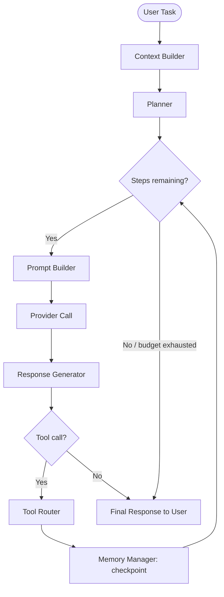

The orchestrator enforces a **step budget** and **token budget** per task; both are user-configurable and surfaced in the UI as a running counter.

---

## 8. Context Engineering

| Source | Extraction Method | Notes |
|---|---|---|
| Current file | VS Code `TextDocument` API | Always included, truncated around cursor if large |
| Open editors | `window.visibleTextEditors` / tab groups | Ranked by recency of focus |
| Imports | Tree-sitter AST parse of current file | Resolves local imports to pull dependent snippets |
| Workspace | File tree + `.gitignore`-aware glob | Used for search/navigation, not blind inclusion |
| Git diff | simple-git `diff`/`status` | Staged + unstaged changes surfaced as high-relevance context |
| Diagnostics | `languages.getDiagnostics()` | Errors/warnings near cursor prioritized |
| Terminal output | Captured via `Terminal.onDidWriteData` shim | Last N lines per active terminal, opt-in |
| Semantic search | Embeddings index (local, incremental) over chunked files | Falls back to keyword search if no embeddings configured |

**Ranking & compression:** candidates are scored by (a) explicit user pin, (b) recency, (c) semantic similarity to the task, (d) diagnostic severity, then greedily packed into the token budget with per-file truncation before exclusion.

---

## 9. Tool System

| Tool | Description | Approval Default |
|---|---|---|
| Read File | Reads file contents (optionally a line range) | Auto-approved |
| Write File | Creates/modifies a file; always shown as Monaco diff | Manual approval |
| Search Files | Glob + content search across workspace | Auto-approved |
| Git | Status, diff, stage, commit, branch operations | Manual for commit/push |
| Terminal | Executes a shell command, captures stdout/stderr | Manual approval |
| Diagnostics | Reads current language-server diagnostics | Auto-approved |
| Browser | Headless fetch/render of a URL for docs lookup | Manual approval |
| MCP | Delegates to an external MCP server's exposed tools | Per-server policy |

### 9.1 Tool Interaction Diagram
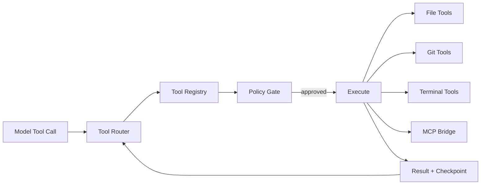
Every tool implements a common `Tool<Input, Output>` interface with a Zod input schema, enabling uniform validation, logging, and MCP tool registration (MCP tool descriptors are adapted into the same interface at connection time).

---

## 10. AI Provider Layer

| Concern | Approach |
|---|---|
| Provider abstraction | Single `ProviderAdapter` interface (`send`, `stream`, `countTokens`, `listModels`) implemented per provider |
| Streaming | Adapters normalize SSE/chunked responses into a common `StreamEvent` union consumed by Response Generator |
| Model switching | Model/provider selection stored per-conversation; switching mid-session re-uses existing context bundle |
| Retry strategy | Exponential backoff (base 500ms, max 3 retries) on 429/5xx; circuit breaker per provider after repeated failures |
| Token management | Provider-specific tokenizers where available (tiktoken for OpenAI-compatible, provider APIs otherwise); estimates cached per model |
| Cost estimation | Local pricing table (per-provider, per-model, input/output rate) multiplied against token counts pre- and post-request |
| BYOK architecture | Keys entered via settings UI, stored via OS secret store, never logged; adapters receive keys through `SecretPort` at call time only |

### 10.1 Provider Architecture Diagram
See Section 5.7. Adapters are registered at extension activation via a `ProviderRegistry`, keyed by provider ID, so adding a provider requires only a new adapter module plus a registry entry — no orchestrator changes (Strategy Pattern).

---

## 11. Security Architecture

| Area | Approach |
|---|---|
| API key storage | VS Code `SecretStorage` API, backed by OS-native stores; keys never written to workspace files or logs |
| Windows | Windows Credential Manager (via VS Code SecretStorage backend) |
| macOS | Keychain Services (via VS Code SecretStorage backend) |
| Linux | Secret Service API / libsecret (via VS Code SecretStorage backend) |
| Terminal confirmation | All terminal tool calls require explicit approval unless the user has enabled a scoped auto-approve allowlist |
| File modification approval | All write/delete operations render a diff and require approval unless auto-approve is explicitly enabled for that workspace |
| Prompt injection protection | Content pulled from files/web/terminal is tagged as untrusted context; system prompt instructs the model to treat it as data, not instructions; tool calls sourced from untrusted context spans require approval regardless of auto-approve settings |
| Path traversal protection | All file tool paths are resolved and validated to remain within the workspace root before execution; symlink targets are re-validated |
| Privacy | No default telemetry; any diagnostic reporting is opt-in and excludes source code and API keys by design |

---

## 12. Development Roadmap

| Phase | Focus | Key Deliverables |
|---|---|---|
| Phase 1 – MVP | Core chat + BYOK | Provider abstraction (OpenAI, Anthropic, Ollama), basic chat webview, file read/write tools with diff approval, SQLite persistence |
| Phase 2 – Smart Context | Context Engine | Tree-sitter import resolution, Git diff context, diagnostics integration, semantic search index |
| Phase 3 – Advanced Agent | Autonomous agent loop | Planner, multi-step tool orchestration, checkpoint/rollback, terminal integration |
| Phase 4 – MCP Support | Ecosystem extensibility | MCP client, server lifecycle management, tool bridging, remaining providers (Gemini, OpenRouter, Groq, DeepSeek, Azure OpenAI) |
| Phase 5 – Desktop IDE Reuse | Portability | Extract `apps/desktop-shell` consuming `packages/core` unchanged; replace VS Code host ports with desktop-native implementations |

---

*End of document.*
